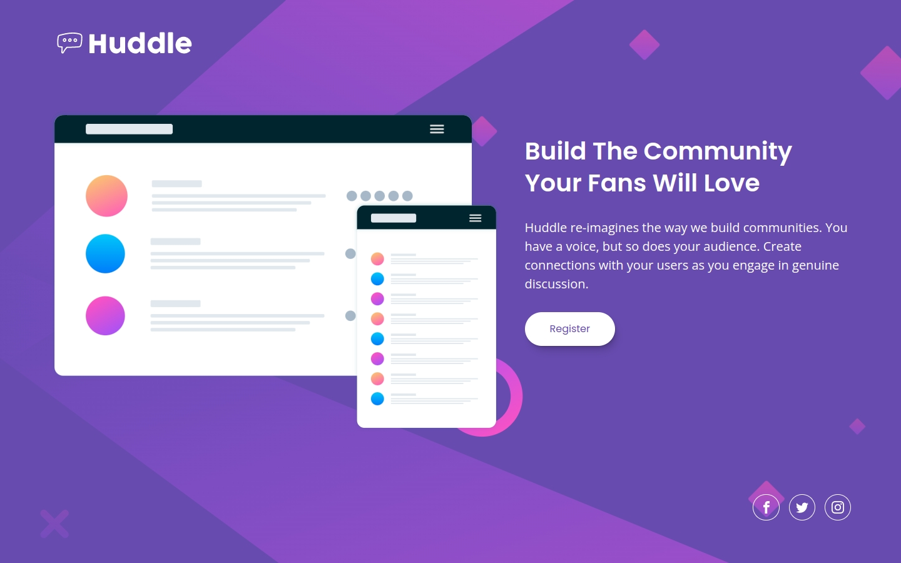

# Frontend Mentor - Huddle landing page with single introductory section solution

This is a solution to the [Huddle landing page with single introductory section challenge on Frontend Mentor](https://www.frontendmentor.io/challenges/huddle-landing-page-with-a-single-introductory-section-B_2Wvxgi0). Frontend Mentor challenges help you improve your coding skills by building realistic projects.

## Table of contents

- [Overview](#overview)
  - [The challenge](#the-challenge)
  - [Screenshot](#screenshot)
  - [Links](#links)
- [My process](#my-process)
  - [Built with](#built-with)
  - [What I learned](#what-i-learned)
  - [Continued development](#continued-development)
  - [Useful resources](#useful-resources)
- [Author](#author)

## Overview

### The challenge

Users should be able to:

- [x] View the optimal layout for the page depending on their device's screen size
- [x] See hover states for all interactive elements on the page

### Screenshot

### Links

- Solution URL: [https://github.com/joshjavier/huddle-landing-page](https://github.com/joshjavier/huddle-landing-page)
- Live Site URL: [https://joshjavier.github.io/huddle-landing-page/](https://joshjavier.github.io/huddle-landing-page/)

## My process

### Built with

- Semantic HTML5 markup
- Flexbox
- Mobile-first workflow
- [CUBE CSS](https://cube.fyi/) methodology
- [Utopia](https://utopia.fyi/) fluid type and space scales
- [Eleventy](https://www.11ty.dev/) static site generator
- [Nunjucks](https://mozilla.github.io/nunjucks/) templating language
- [PostCSS](https://postcss.org/)

### What I learned

Welcome to today's episode of _Josh Tries To Figure Out Frontend Development_!

For this solution, I once again used 11ty and the CUBE CSS methodology. But instead of using Sass, I tried using PostCSS, which basically allows you to extend CSS with as many or as little features as you need.

I've also been reading quite a lot about fluid type and scales recently, so I finally got the chance to try them in this solution. I feel much more comfortable using CSS custom properties because of this. More importantly, I think these concepts are especially important to a front-end developer in understanding how to bridge the gap between code and design.

### Continued development

- Better understanding of SVG
- Master CSS layout

### Useful resources

- [Build Excellent Websites](https://buildexcellentwebsit.es/) - Right now this article is my guiding philosophy for building websites. Big fan of Andy (btw check out his free course [Learn Eleventy From Scratch](https://learneleventyfromscratch.com/)!)

- [CSS Shadow Pallette Generator](https://www.joshwcomeau.com/shadow-palette/) - A fantastic tool from a fellow Josh. Also fits quite well with the fluid type and space scales from Utopia.

- [Components | U.S. Web Design System (USWDS)](https://designsystem.digital.gov/components/overview/) - Kinda like a cheat sheet for common component patterns. I use this as reference so I can build on best practices and don't have to waste time implementing from scratch.

## Author

- Website - [Josh Javier](https://joshjavier.com/)
- Frontend Mentor - [@joshjavier](https://www.frontendmentor.io/profile/joshjavier)
- Twitter - [@joshjavierr](https://twitter.com/joshjavierr)
- LinkedIn - [@joshjavier](https://ph.linkedin.com/in/joshjavier)
